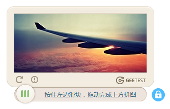

# geetest

yii2-geetest 是基于YII2框架对极验证码的封装。要使用此验证码需要申请appkey，具体请查阅极验证码的官网文档。




## 使用方法

> 下载验证码包

```

composer require dungang/geetest

```

> 编辑项目的配置文件，比如 config/web.php && config/params.php

web.php 添加如下代码

```
    'modules'=>[
        'geetest'=>['class'=>'dungang\geetest\Module']
    ],
    
```

params.php 添加如下代码

```

    'geetest'=>[
        'userId'=>'test',
        'appPcId'=>'b46d1900d0a894591916ea94ea91bd2c',
        'appPcKey'=>'36fc3fe98530eea08dfc6ce76e3d24c4',
        'appMobileId'=>'7c25da6fe21944cfe507d2f9876775a9',
        'appMobileKey'=>'f5883f4ee3bd4fa8caec67941de1b903',
    ],
    
```

> 编辑表单模型文件，比如 LoginForm.php

配置验证规则的组建

```
    /**
     * @return array the validation rules.
     */
    public function rules()
    {
        return [
            // userName and password are both required
            [['userName', 'password','verifyCode'], 'required'],
            // verifyCode needs to be entered correctly
            ['verifyCode',\dungang\geetest\validators\CaptchaValidator::className()],
            // rememberMe must be a boolean value
            ['rememberMe', 'boolean'],
            // password is validated by validatePassword()
            ['password', 'validatePassword'],
        ];
    }
    
```

> 编辑视图文件，比如 login.php

需要跟表单的提交按钮绑定

```

            <?= $form->field($model,'verifyCode')->label(false)
                ->widget(\dungang\geetest\widgets\Captcha::className(),[
                    'clientOptions'=>[
                        'submitButton'=>'#submit',
                        'showType'=>'float'
                    ],

                ])?>
            <?= $form->field($model, 'rememberMe')->checkbox() ?>
            <div class="form-group">
                <?= Html::submitButton(Yii::t('app', 'Login'), ['id'=>'submit','class' => 'btn btn-success btn-block', 'name' => 'login-button']) ?>
            </div>
            
```

## widget 参数配置

```
[
    'platform'=>'pc',  //默认是pc ，还可以设置为mobile 移动端
    'captchaId'=>'geetest' //极验证码的id 
    'clientOptions'=>[
        'submitButton'=>'#submit', //绑定表单的提交按钮
        'showType'=>'float' //验证码的展现形式，之支持pc端，可选值：embed,float,popup
    ],

]
```

## 依赖

"gee-team/gt-php-sdk":"v3.2.0"


## 协议 MIT

The MIT License (MIT)

Copyright (c) 2017 dungang

Permission is hereby granted, free of charge, to any person obtaining a copy of
this software and associated documentation files (the "Software"), to deal in
the Software without restriction, including without limitation the rights to
use, copy, modify, merge, publish, distribute, sublicense, and/or sell copies of
the Software, and to permit persons to whom the Software is furnished to do so,
subject to the following conditions:

The above copyright notice and this permission notice shall be included in all
copies or substantial portions of the Software.

THE SOFTWARE IS PROVIDED "AS IS", WITHOUT WARRANTY OF ANY KIND, EXPRESS OR
IMPLIED, INCLUDING BUT NOT LIMITED TO THE WARRANTIES OF MERCHANTABILITY, FITNESS
FOR A PARTICULAR PURPOSE AND NONINFRINGEMENT. IN NO EVENT SHALL THE AUTHORS OR
COPYRIGHT HOLDERS BE LIABLE FOR ANY CLAIM, DAMAGES OR OTHER LIABILITY, WHETHER
IN AN ACTION OF CONTRACT, TORT OR OTHERWISE, ARISING FROM, OUT OF OR IN
CONNECTION WITH THE SOFTWARE OR THE USE OR OTHER DEALINGS IN THE SOFTWARE.